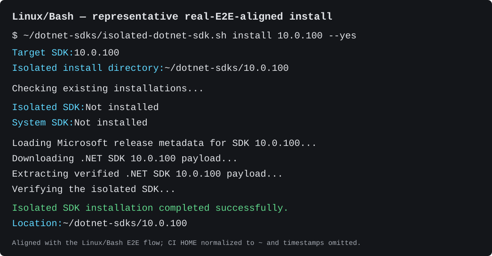
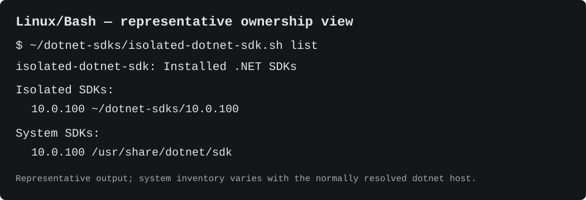
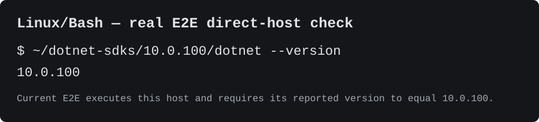

# Isolated .NET SDK

While working through how to evaluate a newer .NET SDK without changing the normal development environment, I wanted the process to be repeatable on Windows, Linux, and macOS. What started as a few install commands turned into a small reusable tool for installing, inspecting, and removing exact SDK versions in isolation.

If you want the reasoning behind the tool, the problems we ran into while testing it, and the role `global.json` plays, start with [How to Test a New .NET SDK Without Installing It System-Wide](https://coding.infoconex.com/post/2026/09/20/how-to-test-a-new-dotnet-sdk-without-installing-it-system-wide), the article this repository grew out of.

Install and manage exact .NET SDK versions outside the normal system-wide .NET installation.

The tool keeps isolated SDKs under:

```text
Windows
C:\Users\<user>\dotnet-sdks\

Linux
/home/<user>/dotnet-sdks/

macOS
/Users/<user>/dotnet-sdks/
```

Each SDK is stored in its own version-specific directory and is not added to `PATH`.

The scripts also run from `dotnet-sdks` rather than from the repository where you invoked them. This prevents a repository-level `global.json` from unexpectedly influencing SDK operations performed by the tool.

## Security and isolation at a glance

- Isolated SDKs and the saved tool live under your user-owned `dotnet-sdks` directory, not in system-wide .NET locations. The tool does not permanently modify the normal `PATH`; you invoke an isolated SDK explicitly.
- "Isolated" describes where the SDK is installed, not a security sandbox. The tool and downloaded .NET SDK/tool code run with the permissions of your current user account and can create normal per-user state.
- For stable releases published under the checksum policy, bootstrap downloads an explicitly tagged platform script and that release's `SHA256SUMS`, verifies the script's SHA-256, then executes and saves those verified bytes. The script and checksum both come through GitHub, so this checks consistency rather than providing independent publisher authentication.
- SDK installation resolves the exact platform archive and SHA-512 from Microsoft release metadata, verifies the archive before extraction, and separately checks that the staged host reports the requested exact SDK version before promotion.
- These controls still trust Microsoft's release-metadata and payload infrastructure, GitHub release/tag/raw-content hosting and repository administration, TLS, and the local platform tools used to download, hash, extract, and execute code.

For the authoritative details, see [`docs/supply-chain-integrity.md`](docs/supply-chain-integrity.md), [`docs/filesystem-safety.md`](docs/filesystem-safety.md), [`docs/release-bootstrap.md`](docs/release-bootstrap.md), [`docs/cross-platform-support.md`](docs/cross-platform-support.md), and [`docs/behavioral-parity.md`](docs/behavioral-parity.md).

## Quick Start — Stable Release

Stable installation is explicitly version-pinned and integrity-checked. Choose a published release that includes the required `SHA256SUMS` asset for checksum-verifying bootstrap, substitute its tag for `<release-tag>`, and use the commands in [`docs/release-bootstrap.md`](docs/release-bootstrap.md). Those commands download both the explicitly tagged platform script and that release's `SHA256SUMS`, verify the script's SHA-256 before execution, and then execute the verified temporary file so file-based bootstrap preserves those exact bytes under `~/dotnet-sdks`.

`v0.1.0` predates this integrity policy and does not have a `SHA256SUMS` release asset. It remains available as legacy history but is not compatible with the checksum-verifying stable bootstrap.

The first verified run creates `~/dotnet-sdks` if needed, saves the platform-specific tool there for future use, and then starts a persistent interactive session. Successful operations and normal cancellations return to the main menu until you explicitly exit. Explicit Install, List, Remove, Verify, or exact-version invocations remain one-shot for automation and scripting.

```text
What would you like to do?

  I. Install an SDK
  R. Remove an isolated SDK
  L. List installed SDKs

  E. Exit

Selection:
```

Normal execution of the saved tool does not auto-update. To update, rerun the verified stable bootstrap with a newer published tag. To roll back, rerun it with an older policy-compliant published tag. The release/bootstrap document contains the copy/paste PowerShell and Bash commands plus the maintainer release contract.

### Development / `main`

Mutable `main` remains available for explicit development testing, but it is not the stable installation path and does not carry the stable-release checksum guarantee.

PowerShell:

```powershell
irm https://raw.githubusercontent.com/infoconex/isolated-dotnet-sdk/main/isolated-dotnet-sdk.ps1 | iex
```

Bash:

```bash
curl -fsSL https://raw.githubusercontent.com/infoconex/isolated-dotnet-sdk/main/isolated-dotnet-sdk.sh | bash
```

Rerunning either development command may refresh the saved tool from newer `main` source.

## Visual Quick Start — Isolation in Practice

The install and direct-host visuals below use the supported Linux/Bash mapping and current real-E2E behavior. CI-only home-directory prefixes and timestamps are normalized so the isolated root is readable as `~/dotnet-sdks`. The List visual is a representative ownership example because the SDKs visible through the normal system `dotnet` host vary by machine and runner image. Windows uses PowerShell and `dotnet.exe`, while macOS uses Bash. See [`docs/cross-platform-support.md`](docs/cross-platform-support.md) for the supported platform mapping.

The fixed `10.0.100` shown here is the repository's reproducible real-E2E target, not a recommendation to prefer it over a newer serviced SDK. Substitute the exact supported SDK version appropriate to your project.

### 1. Install an exact SDK into the isolated root

```bash
"$HOME/dotnet-sdks/isolated-dotnet-sdk.sh" install 10.0.100 --yes
```

`--yes` only bypasses supported confirmation prompts; the exact version and isolated destination are still explicit.



### 2. List installed SDKs by ownership domain

```bash
"$HOME/dotnet-sdks/isolated-dotnet-sdk.sh" list
```

The List action shows recognized SDKs managed under the isolated root first, followed by read-only **System SDKs** reported by the normally resolved `dotnet --list-sdks` host. System SDK discovery is not an exhaustive filesystem scan and does not make those SDKs removable. If the same version exists in both domains, it appears in both groups; an unavailable normal `dotnet` host is shown as an empty System group, while a resolved host whose inventory command fails causes List to fail.



### 3. Invoke that version's host directly

```bash
"$HOME/dotnet-sdks/10.0.100/dotnet" --info
```

The E2E check uses `--version` for a compact assertion that this exact version-specific host reports `10.0.100`; normal `dotnet` arguments such as `--info` work through the same host path.



Nothing in this flow adds the isolated SDK to `PATH` or replaces the normal system `dotnet` installation. The explicit version-specific host path is what selects the isolated SDK. This is installation isolation rather than a security sandbox; see [`docs/filesystem-safety.md`](docs/filesystem-safety.md) and [`docs/behavioral-parity.md`](docs/behavioral-parity.md) for the detailed contract.

## Requirements

The supported product mapping is:

- Windows with PowerShell 7;
- Linux with Bash;
- macOS with Bash.

PowerShell on Linux/macOS and Bash on Windows are not supported product combinations. A system-wide `dotnet` installation is not required.

On Linux and macOS, normal product execution uses standard shell utilities including `curl`, `awk`, `grep`, `sed`, `tr`, `mktemp`, `chmod`, `mv`, and `rm`. SDK installation also requires an available SHA-512 utility (`sha512sum` where available or `shasum -a 512`) so the downloaded SDK archive can be verified before extraction.

Network access is required when bootstrap or installation needs to download remote artifacts. Interactive install selection requires Microsoft's published release index and channel metadata. Supplying an exact SDK version bypasses interactive version discovery, but a new installation still retrieves Microsoft's exact-version release metadata to resolve the supported platform archive and published SHA-512 before downloading the SDK payload.

See [`docs/cross-platform-support.md`](docs/cross-platform-support.md) for the authoritative platform/runtime assumptions.

## Interactive Install

Choosing **Install an SDK**, or explicitly running the `install` action without a version, loads Microsoft's official .NET release metadata and shows the currently supported or development channels.

A channel menu looks similar to:

```text
Select a supported or development .NET channel:

  1. .NET 11.0  STS  Go Live      latest SDK 11.0.100-rc.1.26425.128
  2. .NET 10.0  LTS  Active       latest SDK 10.0.401
  3. .NET 9.0   STS  Maintenance  latest SDK 9.0.318
  4. .NET 8.0   LTS  Maintenance  latest SDK 8.0.425

  S. Show end-of-life channels
  B. Back to Main
  M. Enter an exact SDK version manually
  E. Exit
```

After selecting a channel, the tool starts with a compact SDK list: Microsoft's `latest-sdk` when available plus the newest SDK from each other feature band. Older servicing versions stay available through **Show all versions**. Versions already present on the machine are marked so you can see where they are installed. In a persistent interactive session, **Back** returns from SDK selection to channel selection, from channel selection to Main, and from Remove selection to Main. **E. Exit** leaves the persistent session directly from any selection menu. Explicit one-shot interactive commands remain one-shot and keep `Q. Cancel` where cancellation is the appropriate outcome.

```text
  1. 11.0.100-rc.1.26425.128 (latest, isolated)
  2. 11.0.100-preview.7.26381.103
  3. 11.0.100-preview.6.26359.118
```

The possible markers are:

- `latest` - the latest SDK identified by Microsoft's release metadata;
- `system` - already installed as a **System SDK** through the normally resolved `dotnet` host;
- `isolated` - already installed under `~/dotnet-sdks`.

If you select an SDK that is already installed as a **System SDK**, the existing confirmation still applies before creating an isolated copy.

You can also choose manual entry at either picker when you already know the exact SDK version you want. See [`docs/interactive-sessions.md`](docs/interactive-sessions.md) for the full persistent-session and navigation contract.

### Start the install picker directly

PowerShell:

```powershell
& "$HOME\dotnet-sdks\isolated-dotnet-sdk.ps1" -Action Install
```

Bash:

```bash
"$HOME/dotnet-sdks/isolated-dotnet-sdk.sh" install
```

## Install a Specific SDK

Supplying an exact SDK version bypasses the picker and goes directly to installation.

PowerShell:

```powershell
& "$HOME\dotnet-sdks\isolated-dotnet-sdk.ps1" `
    -Action Install `
    -Version '11.0.100-rc.1.26425.128'
```

Bash:

```bash
"$HOME/dotnet-sdks/isolated-dotnet-sdk.sh" \
    install \
    11.0.100-rc.1.26425.128
```

For convenience, both tools also treat a version supplied without an action as an install request.

PowerShell:

```powershell
& "$HOME\dotnet-sdks\isolated-dotnet-sdk.ps1" `
    -Version '11.0.100-rc.1.26425.128'
```

Bash:

```bash
"$HOME/dotnet-sdks/isolated-dotnet-sdk.sh" \
    11.0.100-rc.1.26425.128
```

If the exact SDK is already installed as a **System SDK**, the tool asks before creating a second isolated copy.

To intentionally create the isolated copy without a confirmation prompt, use the yes option.

PowerShell:

```powershell
& "$HOME\dotnet-sdks\isolated-dotnet-sdk.ps1" `
    -Action Install `
    -Version '10.0.401' `
    -Yes
```

Bash:

```bash
"$HOME/dotnet-sdks/isolated-dotnet-sdk.sh" \
    install \
    10.0.401 \
    --yes
```

## List Isolated SDKs

PowerShell:

```powershell
& "$HOME\dotnet-sdks\isolated-dotnet-sdk.ps1" -Action List
```

Bash:

```bash
"$HOME/dotnet-sdks/isolated-dotnet-sdk.sh" list
```

An explicit List action does not accept a version. Supplying one is treated as invalid input rather than silently ignoring it. A bare version with no action is still the Install convenience form shown above.

## Verify an Isolated SDK

`Verify` / `verify` is a direct-command-only, read-only health check for one exact installed isolated SDK. It is intentionally not on the persistent Main menu.

PowerShell:

```powershell
& "$HOME\dotnet-sdks\isolated-dotnet-sdk.ps1" `
    -Action Verify `
    -Version '10.0.401'
```

Bash:

```bash
"$HOME/dotnet-sdks/isolated-dotnet-sdk.sh" verify 10.0.401
```

A healthy result means the selected version directory exists, its platform-specific `dotnet` host is present and launchable/executable, `dotnet --list-sdks` succeeds, and that host reports the requested exact SDK version. Healthy verification returns zero. A missing installation or host, a non-runnable host, native host failure, or exact-version mismatch returns nonzero with operation-specific context.

Verification does not repair, reinstall, upgrade, delete, or otherwise mutate the isolated SDK. It does not change the normal `PATH` or system `dotnet` installation, does not re-hash every installed SDK file, and does not check or update helper/tool freshness in this initial contract.

## Use an Isolated SDK

The tool does not add isolated SDKs to `PATH` and does not provide a separate `use` action. Invoke the selected version's isolated `dotnet` host directly when you want to use it.

PowerShell on Windows:

```powershell
& "$HOME\dotnet-sdks\10.0.401\dotnet.exe" --info
```

Bash on Linux or macOS:

```bash
"$HOME/dotnet-sdks/10.0.401/dotnet" --info
```

Replace `10.0.401` with the exact version you installed and pass normal `dotnet` arguments after the host path. This isolates the SDK installation itself; it is not a full process or user-profile sandbox, and the .NET CLI can still create normal per-user state during use.

For project-level `global.json`, VS Code/C# tooling, and explicit task examples that preserve this no-PATH model, see [Project and editor use of isolated SDKs](docs/project-editor-usage.md).

## Remove an Isolated SDK

Running `remove` without a version opens a picker containing only SDKs installed under `~/dotnet-sdks`.

PowerShell:

```powershell
& "$HOME\dotnet-sdks\isolated-dotnet-sdk.ps1" -Action Remove
```

Bash:

```bash
"$HOME/dotnet-sdks/isolated-dotnet-sdk.sh" remove
```

You can still remove a specific version directly.

PowerShell:

```powershell
& "$HOME\dotnet-sdks\isolated-dotnet-sdk.ps1" `
    -Action Remove `
    -Version '11.0.100-rc.1.26425.128'
```

Bash:

```bash
"$HOME/dotnet-sdks/isolated-dotnet-sdk.sh" \
    remove \
    11.0.100-rc.1.26425.128
```

PowerShell removal supports native `ShouldProcess` controls. Ordinary removal keeps the tool's existing default-no `[y/N]` confirmation. Use `-WhatIf` to preview the removal without shutting down build servers or deleting the SDK directory:

```powershell
& "$HOME\dotnet-sdks\isolated-dotnet-sdk.ps1" `
    -Action Remove `
    -Version '11.0.100-rc.1.26425.128' `
    -WhatIf
```

Use `-Confirm` when you want PowerShell's native confirmation prompt to be authoritative. Once PowerShell approves or declines the operation, the tool does not add its own duplicate `[y/N]` prompt.

```powershell
& "$HOME\dotnet-sdks\isolated-dotnet-sdk.ps1" `
    -Action Remove `
    -Version '11.0.100-rc.1.26425.128' `
    -Confirm
```

For intentional automation, PowerShell accepts either the existing `-Yes` switch or explicit native confirmation suppression with `-Confirm:$false`:

```powershell
& "$HOME\dotnet-sdks\isolated-dotnet-sdk.ps1" `
    -Action Remove `
    -Version '11.0.100-rc.1.26425.128' `
    -Yes

& "$HOME\dotnet-sdks\isolated-dotnet-sdk.ps1" `
    -Action Remove `
    -Version '11.0.100-rc.1.26425.128' `
    -Confirm:$false
```

`-WhatIf` always takes precedence over `-Yes`. Explicit `-WhatIf` and `-Confirm` are currently supported only for the PowerShell `Remove` action; using them with `Install` or `List` fails rather than implying unsupported risk-mitigation semantics.

After removal is approved, the selected isolated SDK is asked to shut down its build servers before directory deletion. In both implementations, a nonzero shutdown result stops the operation, reports the selected SDK and native exit code where available, and suppresses removal success. Success is reported only after the selected version directory has been removed and verified absent.

The Bash implementation keeps its existing default-no confirmation and `--yes` automation behavior.

```bash
"$HOME/dotnet-sdks/isolated-dotnet-sdk.sh" \
    remove \
    11.0.100-rc.1.26425.128 \
    --yes
```

## Automation and Failure Behavior

For scripts and CI jobs, provide the action and version explicitly rather than using the interactive picker. For PowerShell removal, use `-Yes` or `-Confirm:$false` only when you intentionally approve deletion; use `-WhatIf` for a no-change preview. For Bash, use `--yes` when you intentionally want to bypass the confirmation prompt.

`-Yes` and `--yes` bypass supported confirmation prompts; they do not supply a missing action or version. If a command still needs interactive selection and input is unavailable, the tool fails nonzero with repository-owned context instead of hanging, guessing, or treating end-of-input as a successful cancellation.

Operational failures return a nonzero exit status and do not produce a misleading success result. Choosing to cancel an interactive install or removal is treated as a normal successful no-change user action rather than an operational failure. Exact numeric failure codes may differ between shells unless a narrower contract says otherwise.

## PowerShell / Bash Behavioral Parity

The two implementations share the same product contract where behavior is portable, while retaining shell-native features such as PowerShell `ShouldProcess` and Bash CLI conventions. Observable install, list, remove, confirmation, failure-propagation, cleanup, and status rules are specified in [`docs/behavioral-parity.md`](docs/behavioral-parity.md).

The implementations do not need byte-for-byte output, identical streams, identical casing rules, or identical source structure. Platform-specific host names, PowerShell-only `-WhatIf` / `-Confirm`, and shell-native bootstrap mechanics are intentional differences.

## Directory Layout

After installing an SDK, persistent state looks similar to:

```text
dotnet-sdks/
├── isolated-dotnet-sdk.ps1   # Windows, or
├── isolated-dotnet-sdk.sh    # Linux/macOS
└── 11.0.100-rc.1.26425.128/
```

Only the tool file appropriate to the current platform will normally be present. During installation, exact-version Microsoft release metadata, the downloaded SDK archive, and the `.install-*` staging directory are operation-scoped transaction artifacts. Each attempt owns its temporary files/directories and normally removes them after success or failure; they are not persistent installation state.

## Why This Exists

Installing a preview or release-candidate SDK system-wide is not always necessary when evaluating a .NET upgrade.

This tool provides a repeatable way to install an exact SDK version in a separate directory, invoke it explicitly, and remove it later without changing the SDKs exposed by the normal system `dotnet` installation.

It is isolation of the SDK installation, not a full sandbox. The .NET CLI can still create normal per-user state during first-time use, such as development certificates or telemetry configuration.

## Microsoft Release Metadata

The interactive install picker reads Microsoft's published .NET release metadata from:

```text
https://builds.dotnet.microsoft.com/dotnet/release-metadata/releases-index.json
```

The release index identifies each .NET channel and links to detailed release metadata used to enumerate exact SDK versions. New installations also use the detailed metadata for the chosen exact SDK version to select the supported platform artifact and its published SHA-512. An explicit version bypasses the interactive picker/release-index selection flow, but it does not bypass this integrity metadata lookup.

## Operational Contract Reference

The README and CLI help summarize supported workflows. These repository specifications are authoritative for the detailed operational contracts:

- [`docs/release-bootstrap.md`](docs/release-bootstrap.md) — stable release, bootstrap, update, and rollback semantics;
- [`docs/behavioral-parity.md`](docs/behavioral-parity.md) — shared PowerShell/Bash product behavior and intentional shell-native differences;
- [`docs/cross-platform-support.md`](docs/cross-platform-support.md) — supported OS/runtime mapping and platform assumptions;
- [`docs/filesystem-safety.md`](docs/filesystem-safety.md) — isolated-root ownership, staging, cleanup, transactional install, and recovery semantics;
- [`docs/native-command-failures.md`](docs/native-command-failures.md) — correctness-significant external-command failure boundaries;
- [`docs/supply-chain-integrity.md`](docs/supply-chain-integrity.md) — remote-artifact integrity controls and residual trust boundaries.

## Microsoft References

- [Test prerelease .NET SDKs locally](https://learn.microsoft.com/en-us/dotnet/core/tools/test-prerelease-sdk-locally)
- [`dotnet build-server`](https://learn.microsoft.com/en-us/dotnet/core/tools/dotnet-build-server)
- [`global.json` overview](https://learn.microsoft.com/en-us/dotnet/core/tools/global-json)
- [.NET release metadata](https://github.com/dotnet/core/tree/main/release-notes)

## Security Note

Stable bootstrap for releases that include the required `SHA256SUMS` asset verifies the explicitly tagged script against that release's checksum before execution. For SDK installation, the tool resolves the exact platform archive and SHA-512 from Microsoft's release metadata, downloads the archive into operation-owned state, and verifies the checksum before extraction. Exact-version staged-host verification remains a separate correctness check before promotion. Because Microsoft controls both the metadata/checksum and payload distribution, this improves integrity without claiming independent third-party publisher authentication. Development commands intentionally consume mutable `main` and do not receive the stable-release integrity guarantee. See [`docs/supply-chain-integrity.md`](docs/supply-chain-integrity.md) for the complete integrity model.

## License

MIT
